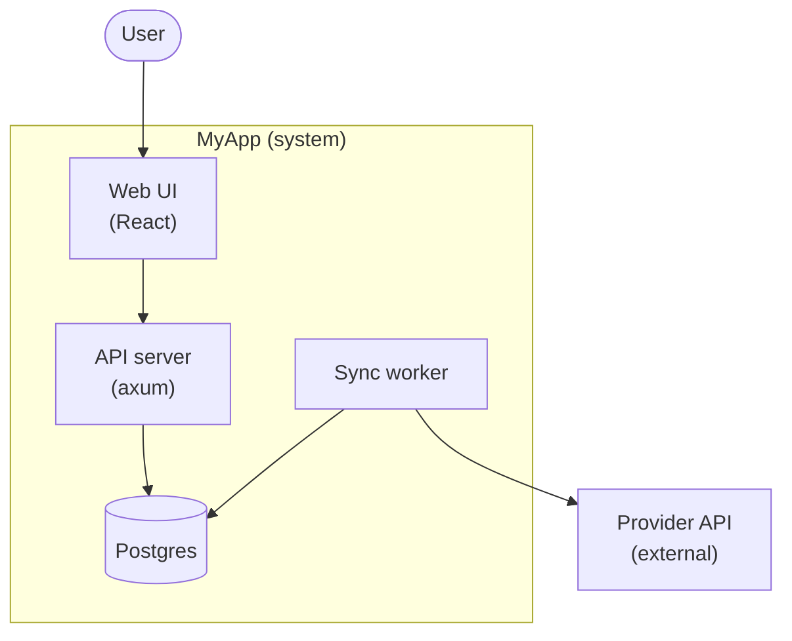

# Formal spec surfaces — EARS, Gherkin, ADRs, C4-from-codemap

Formats for spec-bootstrap's optional formalization (Phase 4) and architecture
record (Phase 5 step 4). All four are *additions to* the prose spec, never
replacements — prose carries intent; these carry precision, testability, and
the why.

## §1 — EARS requirements

EARS (Easy Approach to Requirements Syntax) removes the ambiguity that prose
hides. Five patterns; pick the one that matches the statement's nature:

| Pattern | Form | Use for |
|---|---|---|
| Ubiquitous | `THE SYSTEM SHALL <response>` | always-true invariants |
| Event-driven | `WHEN <trigger> THE SYSTEM SHALL <response>` | reactions |
| State-driven | `WHILE <state> THE SYSTEM SHALL <response>` | mode-dependent behavior |
| Unwanted-event | `IF <condition>, THEN THE SYSTEM SHALL <response>` | error/abuse handling |
| Optional-feature | `WHERE <feature is present> THE SYSTEM SHALL <response>` | configurable behavior |

Worked rewrites (prose stays in the spec; EARS sits beneath it):

- "Deletes need confirmation" →
  `WHEN the user requests deletion of an account THE SYSTEM SHALL require an
  explicit confirmation token before any data is removed.` `[confirmed]`
- "Handle provider outages gracefully" →
  `IF the provider API is unreachable, THEN THE SYSTEM SHALL queue the request
  and retry with exponential backoff (cap 5 min), preserving order.` `[observed]`
- "Categorization threshold" →
  `THE SYSTEM SHALL apply a category only when classifier confidence ≥ 0.75.` `[observed]`

Discipline:
- Apply EARS **only where ambiguity is expensive**: data loss, security,
  privacy, money, concurrency, retention. A spec that is 100% EARS is
  unreadable; a spec that is 0% EARS hides its sharpest requirements.
- One requirement per EARS line. "…SHALL X and Y" is two lines.
- The EARS line inherits the prose statement's provenance marker.
- Checklist generation (app-audit Step 1.3) treats an EARS line as a
  ready-made checklist item — trigger, state, and expected response are
  already explicit.

## §2 — Gherkin scenarios

For **user-facing musts**, a Gherkin scenario is the requirement and the test
specification in one:

```gherkin
# SPEC §4.2 — destructive actions [confirmed]
Scenario: Deleting an account requires confirmation
  Given a signed-in user with an existing account
  When they request account deletion without a confirmation token
  Then the API responds 409 and no data is removed
  When they repeat the request with a valid confirmation token
  Then the account and its data are removed and an audit event is written
```

Rules:
- Every scenario carries its spec section number — that's the traceability
  hook (app-audit's `references/spec-surface.md`).
- Scenarios **seed the acceptance map** (app-audit Step 1.3b): each one is a
  row; a row with no implementing test is UNMAPPED *with the assertion already
  written* — the missing test's content is specified, not just its existence.
- Provenance carries over. A scenario formalizing an `[assumed]` statement is
  itself assumed: keep it in the spec's open-questions orbit and OUT of the
  acceptance map until the user confirms.
- Concrete values over abstractions ("409", "0.75") — vagueness in a scenario
  reproduces the prose ambiguity it was meant to remove.

## §3 — ADR template (docs/adr/NNNN-<slug>.md)

```markdown
# ADR 0003: Pull-based sync (no provider webhooks)

- Status: accepted  (proposed | accepted | superseded by ADR-NNNN)
- Date: 2026-06-12
- Spec: §5.1

## Context
Webhooks require a public endpoint; this app is local-first and must work
behind NAT without exposing a port. Provider webhook payloads also omit the
fields the categorizer needs, forcing a fetch anyway.

## Decision
Sync pulls on an interval (default 5 min) with cursor-based incremental fetch.

## Consequences
- (+) No public surface; works offline-first; one code path for backfill/sync.
- (−) Updates are up to one interval late; rate-limit budget is consumed by
  polling. Revisit if the provider ships filtered webhooks (ADR would be
  superseded, not edited).
```

Discipline: one decision per ADR; never edit an accepted ADR's Decision —
supersede it with a new one (history is the value); the spec section cites the
ADR and vice versa. Bootstrap seeds ADRs from interview answers that contain a
*why* — "Postgres only, because we tried SQLite and hit write contention" is
an ADR; "Postgres only" alone is just a spec line.

## §4 — C4-style diagram from the codemap (Mermaid)

Two levels are derivable from cartographer + Phase 1's inventory; don't
hand-wave deeper levels (component/code) — they rot fastest.

- **Context (L1)**: the system, its users, and the external systems — from the
  inventory's surfaces + external integrations.
- **Container (L2)**: the deployable/runnable pieces and their data stores —
  from `structure.json` top-level layout + `dependencies.json` edges +
  detected DBs/queues.



Rules: label every node with its technology; external systems outside the
subgraph; data stores as cylinders; **derive edges from `dependencies.json` /
the call graph — never draw an edge the codemap can't support**. Mark the
diagram `[observed]` with the codemap refresh SHA, and regenerate on request
instead of hand-editing (same view-not-store rule as the dashboard).
